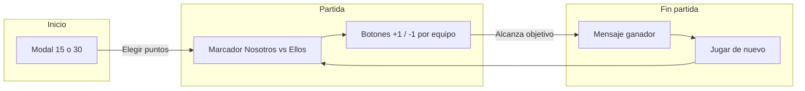

# Plan: SPA Marcador Truco (Vite + React + Tailwind)

## Alcance

- **Equipos**: "Nosotros" (izquierda) y "Ellos" (derecha).
- **Puntuación**: Botón +1 y botón -1 por equipo; puntuación mínima 0.
- **Modal inicial**: Preguntar "¿Jugar a 15 o 30 puntos?" antes de mostrar el marcador.
- **Victoria**: Al llegar al objetivo (15 o 30), mostrar ganador y un botón "Jugar de nuevo" que pone ambos equipos en 0 y permite seguir jugando.
- **Stack**: Vite, React, Tailwind CSS.
- **Estética**: Fondo tipo mesa de madera con opacidad para que el marcador sea legible.

---

## 1. Inicialización del proyecto

- Crear proyecto con **Vite** (plantilla `react`) y luego instalar y configurar **Tailwind CSS** v4 (o v3 si se prefiere estabilidad).
- Estructura de carpetas sugerida:
  - `src/` → `App.jsx`, `main.jsx`, `index.css`
  - `src/components/` → componentes reutilizables (modal, scoreboard, etc.)
  - `public/` → favicon y, si se usa, imagen de textura de madera.

---

## 2. Estado global del juego

Mantener en el componente principal (o en un contexto mínimo) un estado que incluya:

- `targetPoints`: `15` o `30` (elegido en el modal).
- `showModal`: booleano para mostrar/ocultar el modal de elección (solo al inicio hasta que el usuario elija).
- `nosotros`: puntuación del equipo "Nosotros".
- `ellos`: puntuación del equipo "Ellos".
- `winner`: `null` | `"Nosotros"` | `"Ellos"` para saber si hay ganador y mostrar mensaje + botón de reinicio.

Lógica:

- Al cargar la app: `showModal = true`, resto en valores por defecto (0, null).
- Al elegir 15 o 30: cerrar modal (`showModal = false`) y guardar `targetPoints`.
- Al sumar/restar: actualizar `nosotros` o `ellos`; no permitir valores &lt; 0; después de cada cambio, comprobar si alguno alcanzó `targetPoints` y setear `winner`.
- Al pulsar "Jugar de nuevo": `nosotros = 0`, `ellos = 0`, `winner = null` (el objetivo de puntos se mantiene).

---

## 3. Flujo de la interfaz

- **Paso 1**: Si `showModal === true` → renderizar solo el modal (overlay) con dos botones: "15 puntos" y "30 puntos".
- **Paso 2**: Si no hay modal → mostrar el marcador: dos columnas (Nosotros | Ellos), cada una con:
  - Nombre del equipo.
  - Puntuación actual (grande y legible).
  - Botón "+1" y botón "-1".
- **Paso 3**: Si `winner !== null` → debajo del marcador: texto "¡Ganaron [Nosotros/Ellos]!" y botón "Jugar de nuevo" que ejecuta la función de reinicio.

---

## 4. Componentes sugeridos

| Componente                 | Responsabilidad                                                                                                                                               |
| -------------------------- | ------------------------------------------------------------------------------------------------------------------------------------------------------------- |
| `App.jsx`                  | Estado (targetPoints, showModal, nosotros, ellos, winner), handlers (elegir puntos, +1, -1, reinicio) y layout general (fondo + contenedor).                  |
| `StartModal.jsx`           | Modal con título "¿A cuántos puntos jugamos?" y botones "15" y "30". Recibe `onSelect(targetPoints)` y opcionalmente estilo para que se vea sobre la madera.  |
| (Opcional) `ScoreCard.jsx` | Una tarjeta por equipo: nombre, puntaje, botones +1/-1. Recibe `name`, `score`, `onIncrement`, `onDecrement`, `disabled` (por ejemplo cuando ya hay ganador). |

Se puede hacer todo en `App.jsx` con secciones claras si se prefiere menos archivos; los componentes extra mejoran legibilidad y pruebas.

---

## 5. Estilo: mesa de madera y legibilidad

- **Fondo**:  
  - Opción A: Imagen de textura de madera en `public/` (ej. `wood-table.jpg`), aplicada al body o a un div full-screen con `background-size: cover` y `background-position: center`.  
  - Opción B: Gradiente + ruido o textura CSS (por ejemplo `repeating-linear-gradient` con tonos marrones) para simular vetas.
- **Contenedor del marcador**:  
  - Un `div` centrado que envuelva modal/marcador/ganador con fondo semi-transparente (por ejemplo `bg-black/60` o `bg-amber-950/80`) y `backdrop-blur-sm` para mejorar contraste.  
  - Bordes redondeados y padding generoso para que el bloque no toque los bordes de la “mesa”.
- **Tipografía**: Títulos y números en blanco o crema (`text-white` / `text-amber-50`) y tamaño grande para los puntajes (por ejemplo `text-5xl` o `text-6xl`).  
- **Botones**: Estilo sólido o outline que contraste con el fondo (por ejemplo `bg-amber-600` / `border-amber-500`) y estados hover/active con Tailwind.

Con esto se cumple: fondo tipo madera, opacidad/blur en el área del marcador y buena legibilidad.

---

## 6. Detalles de implementación

- **Validación -1**: En el handler de restar, usar `Math.max(0, score - 1)` (o equivalente) para que nunca baje de 0.
- **Deshabilitar botones al ganar**: Cuando `winner !== null`, se pueden deshabilitar los botones +1/-1 (o ocultarlos) para evitar seguir sumando tras la victoria; el único acción permitida es "Jugar de nuevo".
- **Accesibilidad**: Botones con `aria-label` si hace falta (ej. "Nosotros sumar un punto", "Reiniciar partida"). El modal puede tener `role="dialog"` y foco atrapado si se desea refinar después.

---

## 7. Archivos a crear/editar

- `package.json` (generado por Vite) + instalar Tailwind y dependencias.
- `vite.config.js` (por defecto Vite).
- `tailwind.config.js` y/o `postcss.config.js` según versión de Tailwind; en `index.css` incluir directivas `@tailwind base/components/utilities`.
- `index.html` → entrada con `script` a `main.jsx`.
- `src/main.jsx` → render de `<App />` en el root.
- `src/App.jsx` → estado, lógica y estructura (modal + marcador + mensaje ganador + botón reinicio).
- `src/index.css` → estilos base y clases Tailwind; estilos del body para el fondo de madera.
- `src/components/StartModal.jsx` (y opcionalmente `ScoreCard.jsx`).
- Opcional: `public/wood-table.jpg` (o similar) si se usa imagen de fondo.

---

## 8. Orden de trabajo recomendado

1. Crear proyecto Vite + React e instalar/configurar Tailwind.
2. Implementar estado y lógica en `App.jsx` (modal, puntajes, ganador, reinicio).
3. Implementar `StartModal` y el layout del marcador con botones +1/-1.
4. Añadir mensaje de ganador y botón "Jugar de nuevo".
5. Aplicar fondo de madera (imagen o CSS) y contenedor con opacidad/blur para legibilidad.
6. Ajustar tipografía, tamaños y colores de botones hasta que la lectura sea cómoda sobre la mesa.

Si quieres, en el siguiente paso se puede bajar al detalle de código (por ejemplo el JSX exacto del marcador o la estructura del estado en React).